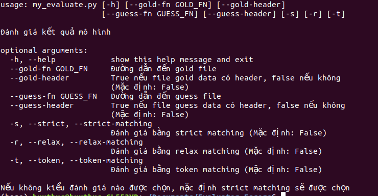

# Evaluator_Fscore

- Script đánh giá điểm Fscore cho Named Entity Recognition - POS tagging.

- Có 3 kiểu đánh giá:
  - Strict matching: cần dự đoán đúng tất cả token trong một entity mới tính là đúng entity đó.
  - Relax matching: chỉ cần dự đoán đúng 1 phần token trong 1 entity thì được tính là đúng entity đó.
  - Token matching: xem một token là một entity.

# Cách sử dụng
Yêu cầu:
  
  - File gold và guess tách biệt nhau
  
  - Định dạng file theo format: mỗi dòng là 1 token từ câu, dạng word<tab>label, mỗi câu cách nhau bằng dòng trắng.
  
usage: 
``` bash
my_evaluate.py [-h] [--gold-fn GOLD_FN] [--gold-header]
                      [--guess-fn GUESS_FN] [--guess-header] [-s] [-r] [-t]
```


